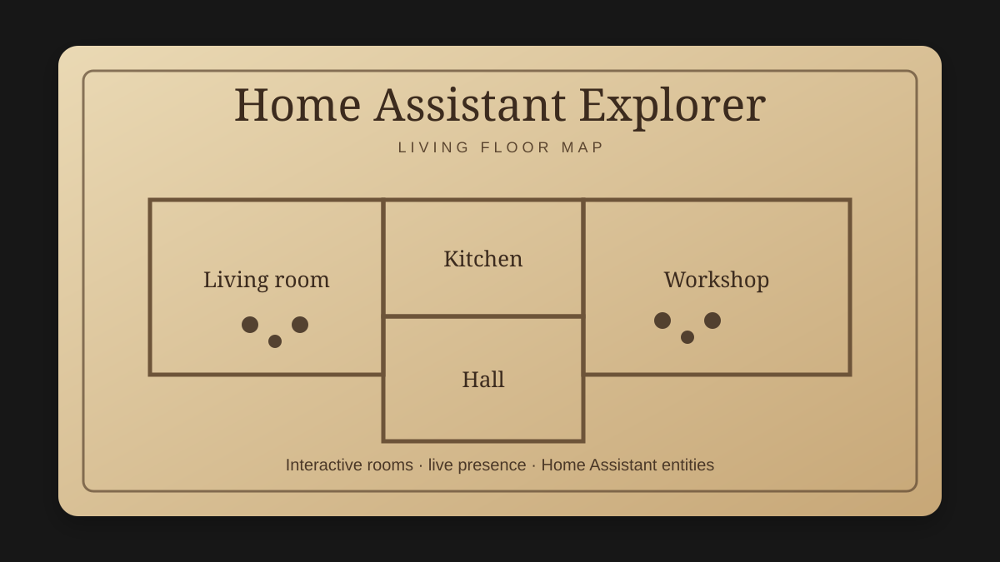

# Home Assistant Explorer

A living, interactive floor map card for Home Assistant.



> Home Assistant Explorer is in active development. The card combines an SVG floor plan, interactive rooms and live presence objects with Home Assistant entities.

## Features

- Custom Lovelace card: `custom:ha-explorer-card`
- SVG, PNG and JPG floor plans
- Native inline SVG rendering
- Zoom and pan controls
- Interactive room polygons
- Room detail panel with live entity states, aggregate light controls and scene/script shortcuts
- Presence objects for people, pets, robots, vehicles and custom objects
- Home Assistant entity binding
- Room-aware automatic presence placement
- Circular Home Assistant profile avatars for presence markers
- Visual room binding and presence setup editor
- Visual room polygon drawing directly on the floorplan
- Visual presence-anchor placement
- Home Assistant Area Registry integration
- Backend-independent room tracking
- HACS-compatible release assets

## Room scenes and quick actions

Version 0.27 adds room-level actions without requiring manual YAML:

- **Tænd alt** and **Sluk alt** appear automatically for every room with bound light reactions
- Add Home Assistant `scene.*` and `script.*` entities from the visual editor
- Give each shortcut a custom Danish label and a short glyph or emoji
- Actions are restricted to the safe `scene.turn_on`, `script.turn_on`, `light.turn_on` and `light.turn_off` services
- Pending and error states are shown directly in the room panel

Open **Rumscener og hurtighandlinger** under the advanced editor tools, select a room, then choose a scene or script from Home Assistant.

## Interactive rooms

Click or tap a configured room on the live floorplan to open its room panel. The panel reuses the room's existing Living Entity Point bindings and shows:

- People and tracked objects currently placed in the room
- Live light, motion, media, opening and temperature states
- Direct **On / Off** controls for bound light entities
- Native Home Assistant more-info dialogs for every bound entity

No additional room-panel configuration is required. Rooms without entity reactions still open and explain that bindings can be added in the visual editor.

## HACS installation

Add this repository to HACS as a custom **Dashboard** repository, then download the latest release.

```text
https://github.com/MVtag/ha-explorer-card
```

After installation, add a card with:

```yaml
type: custom:ha-explorer-card
title: Home Assistant Explorer
image: /local/explorer/floorplan.svg
fit_mode: contain
```

## Visual setup editor

The card editor contains the normal setup sections plus a visual floorplan editor:

- **Kort** — title, floorplan, fit mode and zoom limits
- **Rum** — bind Explorer rooms to Home Assistant Areas, edit aliases and adjust the presence anchor
- **Personer & objekter** — add/remove presence objects, select the primary Home Assistant entity, choose a room-tracking entity and configure a static fallback room
- **Visual Room Editor** — draw new room polygons, redraw existing room boundaries and place presence anchors directly on the floorplan

Explorer does not require a specific presence backend. A `room_entity` may come from Bermuda, ESPresense, a Home Assistant helper or any other integration that exposes the current room as an entity state.

### Drawing a room

1. Open the visual editor for the card.
2. Scroll to **Visual Room Editor**.
3. Select **Nyt rum**.
4. Enter a room name and optionally select a Home Assistant Area.
5. Tap/click around the room boundary on the floorplan.
6. Use at least three points and choose **Gem rum**.
7. Select the room and choose **Placér personpunkt** to set where presence markers should normally appear.

The editor automatically stores drawing coordinates as normalized values from `0` to `1`, so the resulting configuration remains compatible with YAML and the existing Explorer room engine.

Existing rooms can be selected directly on the editor preview and redrawn without changing their semantic metadata. The old geometry is preserved until the new polygon is saved.

## Room-aware presence placement

Rooms use normalized coordinates from `0` to `1`. A room can optionally be linked to a Home Assistant Area ID and can define a preferred point for presence objects.

```yaml
rooms:
  - id: kitchen
    name: Køkken
    area_id: kitchen
    aliases:
      - Køkken
    presence_anchor:
      x: 0.25
      y: 0.73
    points:
      - [0.08, 0.58]
      - [0.31, 0.58]
      - [0.31, 0.96]
      - [0.08, 0.96]
```

A presence object can use one entity for its identity and another entity for its current room. When `room_entity` is configured, Explorer reads that entity's state and matches it against the room's `id`, `area_id`, `name` or `aliases`.

```yaml
presences:
  - id: marc
    name: Marc
    type: person
    entity_binding:
      entity: person.marc_poulsen
      room_entity: sensor.marc_room
```

When the primary entity has an `entity_picture`, Explorer renders it as a circular avatar. An explicit `name` on the presence object takes priority over the entity's `friendly_name`.

The primary entity is optional when only room tracking is needed:

```yaml
presences:
  - id: room-only-test
    name: Marc
    type: person
    entity_binding:
      room_entity: input_select.explorer_room_test
```

If the room sensor exposes the room as an attribute instead of its state, set `room_attribute`:

```yaml
entity_binding:
  entity: person.marc_poulsen
  room_entity: sensor.marc_presence
  room_attribute: area_id
```

The primary bound entity can also expose an `explorer_room` attribute directly:

```yaml
entity_binding:
  entity: sensor.marc_explorer
```

Static room placement is supported without an entity:

```yaml
presences:
  - id: robot
    name: Robot
    type: robot
    room_id: kitchen
```

Manual `x` and `y` coordinates remain supported as fallback values. If a room has no explicit `presence_anchor`, Explorer uses the room label position or calculates a suitable anchor from the room polygon.

## Entity binding

The default entity attributes are:

```yaml
explorer_x: 0.28
explorer_y: 0.34
friendly_name: Marc
entity_picture: /local/explorer/marc.png
explorer_color: "#03a9f4"
explorer_room: kitchen
```

`entity_picture` is treated as an avatar image rather than text. The avatar attribute can be changed with `avatar_attribute`. Text/icon binding is only read when an explicit `icon_attribute` is configured.

Custom attribute names can be configured with `x_attribute`, `y_attribute`, `name_attribute`, `icon_attribute`, `avatar_attribute`, `color_attribute`, `visible_attribute` and `room_attribute`.

### Movement History 2.0

Movement history is optional and disabled by default. It is stored only in the running card and is automatically discarded after 1–5 minutes.

```yaml
movement_history:
  enabled: true
  duration_minutes: 3
  show_rooms: true
```

Each person keeps an independent fading history using their configured marker or trail colour. Pet and robot histories are configured separately below.

### Pet & Robot Trails 2.0

Pet paws and robot routes have their own optional history layer:

```yaml
pet_robot_trails:
  enabled: true
  duration_minutes: 3
  show_pet_paws: true
  show_robot_route: true
  robot_direction_arrows: true
```

Pet profiles receive detailed paw prints in their individual trail colour. Robot profiles receive a continuous route with optional direction arrows.

### Shelly Presence Gen4 Pet Detection

Explorer can filter a Shelly LiveTrack target by height before showing it as a pet. The detector uses hysteresis, several consecutive samples and `target_id` continuity so a short noisy reading is not immediately shown as a rabbit.

```yaml
presences:
  - id: kanin
    name: Kanin
    type: pet
    room_id: stue
    icon: "🐇"
    entity_binding:
      position_entity: sensor.stue_presence_stuen_target_1
      coordinate_space: room_meters
      x_attribute: x
      y_attribute: y
    shelly_pet_detection:
      enabled: true
      height_attribute: maxz
      target_id_attribute: target_id
      timestamp_attribute: timestamp
      max_height_m: 0.75
      release_height_m: 0.95
      confirmation_updates: 3
      release_updates: 2
```

The visual editor contains the same settings under **Shelly Pet Detection**. Room calibration is shared with other `room_meters` targets.

## Development

```bash
npm install
npm run typecheck
npm run build
```

The production file is generated as:

```text
dist/ha-explorer-card.js
```

## Roadmap

Only the remaining planned work is listed here. Features that are already implemented are intentionally removed from the roadmap.

The v0.46.1 rendering and memory cleanup is complete. Weather masks and filters are now reused across transitions, pending animation frames and timers are cancelled on disconnect, and rapid weather changes keep only a bounded number of outgoing scenes.

1. **Editor performance** — reduce editor re-rendering and keep large configurations responsive.
2. **Final stability pass** — verify lifecycle cleanup, mobile interactions, and long-running dashboards.

## License

MIT
